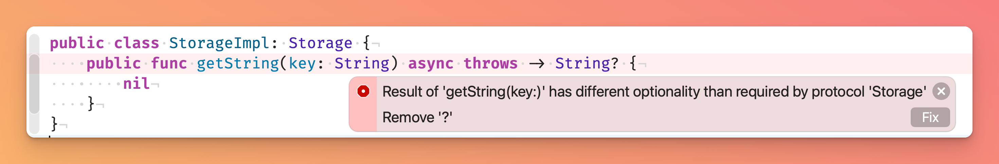
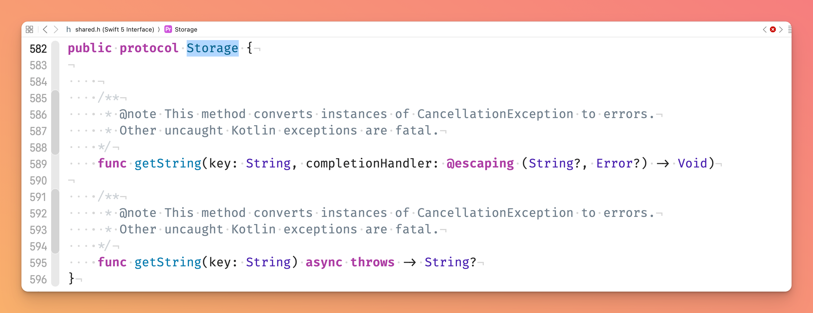

# SKIE regression issue sample

This sample project demonstrates regression in SKIE 0.6.0.

https://github.com/touchlab/SKIE/issues/51

# Sample Layout

* `kmp` sample KMP library with single `shared` module
* `ios` Swift Package that 

`make ios` to build XCFramework from the shared library and iOS sample project.

# Sample Code

There is a single interface in the `kmp/shared` module
```kotlin
interface Storage {
    suspend fun getString(key: String): String?
}
```

And empty implementation of the interface in `ios/lib`
```swift
public class StorageImpl: Storage {
    public func getString(key: String) async throws -> String? {
        nil
    }
}
```

# SKIE 0.6.0

Run `make ios`. The build will fail with an error
```
...lib/StorageImpl.swift:4:17: error: result of 'getString(key:)' has different optionality than required by protocol 'Storage'
    public func getString(key: String) async throws -> String? {
                ^                                            ~
                                                             
shared.Storage:3:10: note: requirement 'getString(key:)' declared here
    func getString(key: String) async throws -> String
         ^

** BUILD FAILED **
```

This is how the error looks in Xcode


Which is a bit weird, since we defined an optional return type in Kotlin. And even more weird if we navigate to the module's header in Xcode and check the Swift counterpart.



# SKIE 0.5.6

Update SKIE version in `kmp/gradle/libs.versions.toml` to `0.5.6` and run `make ios`. The build will finish successfully
```
** BUILD SUCCEEDED **
```

# What changed with SKIE 0.6.0

Let's examine what changes about the type from Swift's point of view. 

First, we'll look at the header file `kmp/shared/build/XCFrameworks/release/shared.xcframework/ios-arm64/shared.xcframework/Headers/shared.h` to check the type definition provided to Objc/Swift.

Both SKIE `0.6.0` and `0.5.6` have the same
```
__attribute__((swift_name("Storage")))
@protocol SharedStorage
@required

- (void)getStringKey:(NSString *)key completionHandler:(void (^)(NSString * _Nullable_result, NSError * _Nullable))completionHandler __attribute__((swift_name("getString(key:completionHandler:)")));
@end
```

Then there is a `shared.apinotes` file next to the header. As stated in the [README](https://github.com/apple/swift/blob/main/apinotes/README.md) Swift compiler uses information from the apinotes file to "to provide a better mapping of Objective-C APIs into Swift."

As it turns out there are differences in `kmp/shared/build/XCFrameworks/release/shared.xcframework/ios-arm64/shared.xcframework/Headers/shared.apinotes`. 

SKIE `0.6.0`
```
- Name: "SharedStorage"
  SwiftName: "Storage"
  Methods:
  ...
  - Selector: "getStringKey:completionHandler:"
    MethodKind: "Instance"
    SwiftName: "getString(key:completionHandler:)"
    ResultType: "void"
    Parameters:
    - Position: 0
      Type: "NSString * _Nonnull"
    - Position: 1
      Type: "void (^ _Nonnull)(NSString * _Nullable, NSError * _Nullable)"
   ...
```

SKIE `0.5.6`
```
- Name: "SharedStorage"
  SwiftName: "Storage"
  Methods:
  ...
  - Selector: "getStringKey:completionHandler:"
    MethodKind: "Instance"
    SwiftName: "getString(key:completionHandler:)"
    ResultType: "void"
    Parameters:
    - Position: 0
      Type: "NSString *_Nonnull "
    - Position: 1
      Type: "void (^_Nonnull )(NSString * _Nullable_result, NSError * _Nullable)"
   ...
```

There is difference in `completionHandler` parameter type defintions
* `0.6.0` - `Type: "void (^ _Nonnull)(NSString * _Nullable, NSError * _Nullable)"`
* `0.5.6` - `Type: "void (^_Nonnull )(NSString * _Nullable_result, NSError * _Nullable)"`

The first argument of the block is marked as `_Nullable` in `0.6.0` and `_Nullable_result` in `0.5.6`. But what is the difference and why does it affect Swift code if they both seem to be nullable.

> Note that it's marked as `_Nullable_result` in the header

## What is _Nullable_result

Swift evolution [0297 proposal](https://github.com/apple/swift-evolution/blob/main/proposals/0297-concurrency-objc.md) states:

> The translation of an asynchronous Objective-C completion-handler method into an `async` Swift method follows the normal translation procedure, with the following alterations:
> 
> * The completion handler parameter is removed from the parameter list of the translated Swift method.
> * If the method can deliver an error, it is `throws` in addition to being `async`.
> * The parameter types of the completion handler block type are translated into the result type of the `async` method, subject to the following additional rules:
>   * If the method can deliver an error, the `NSError *` parameter is ignored. 
>   * If the method can deliver an error and a given parameter has the `_Nullable_result` nullability qualifier (see the section on Objective-C attributes below), it will be imported as optional. Otherwise, it will be imported as non-optional.
>   * If there are multiple parameter types, they will be combined into a tuple type.
>
> ...
>
> `_Nullable_result`. Like `_Nullable`, indicates that a pointer can be null (or `nil`). `_Nullable_result` differs from `_Nullable` only for parameters to completion handler blocks. When the completion handler block's parameters are translated into the result type of an `async` method, the corresponding result will be optional.

And that's exactly why the Swift compiler fails the build: to it, the signature of an async variant of the method changed.
